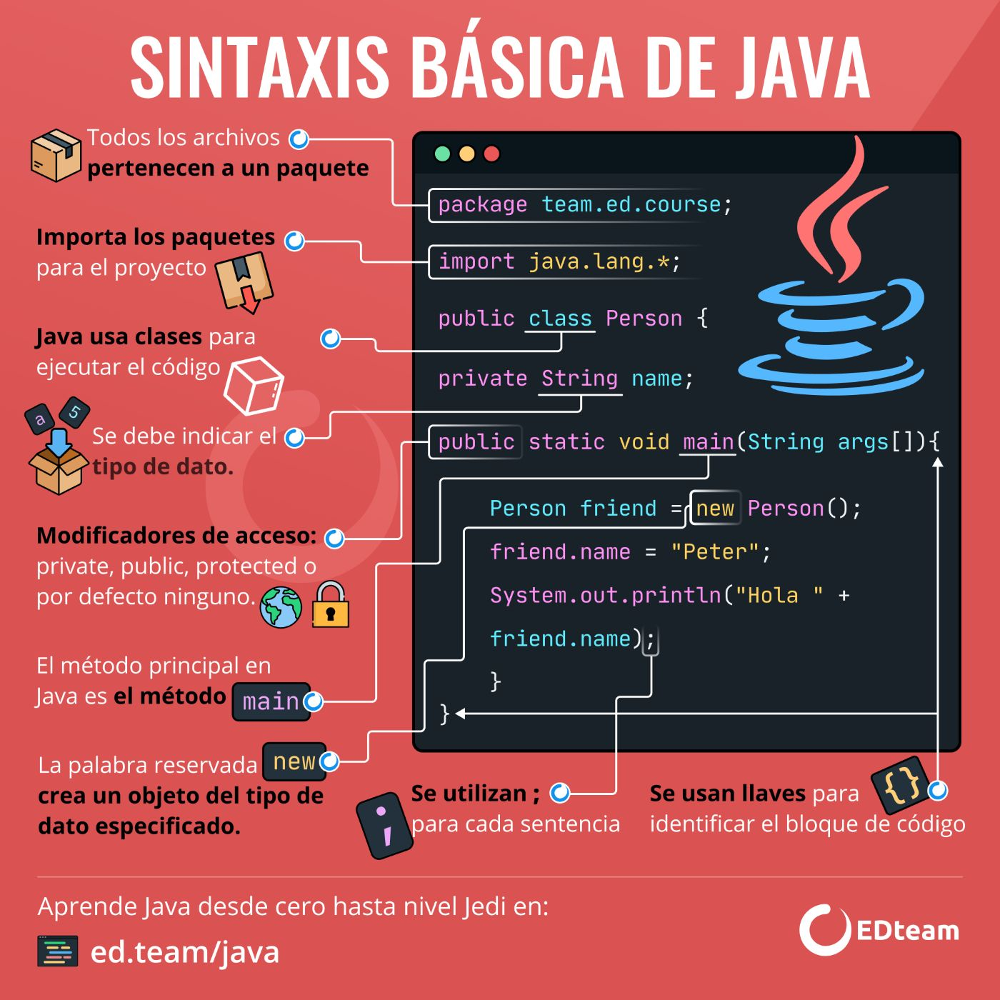
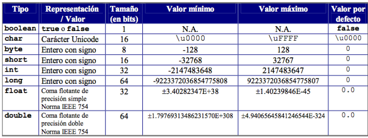

# <span style="color: #FF4767;">**PRIMERA CLASE**</span>

**Fecha:** 07 de noviembre 2023

***Nota:*** *Para la clase de programación II, es recomendable practicar (jugar) mecanografía*

# 1.- <span style = "color: #007ACC;">IDE Visual Studio Code</span>

## ¿Qué es?

Visual Studio Code es un editor de código fuente y de código abierto.
Destaca por ser multiplataforma y será el utilizado en esta materia.

### <span style = "color: #007ACC;">PASOS PARA EL FUNCIONAMIENTO DEL IDE

0. Se instaló el jdk en oracle.
1. Se instaló gitbash.
2. Se instaló el VSCode.
3. Se creó una cuenta de github.
4. Se integró la cuenta github al VSCode.
5. Consola.

### <span style= "color: #007ACC;">Configuración de VSCode</span>

+ Se vinculó la cuenta de GitHub dentro de VSCode para poder trabajar en la nube.
+ Se creó una carpeta para la materia en OneDrive para poder trabajar.
+ Dentro de esta se creó una carpeta ***.md*** para trabajar MarkDown, misma que permitirá llevar los **apuntes** de la clase.
+ Dentro de VSC es necesario instalar las respectivas *extensiones* para que se pueda trabajar en los proyectos de acorde a sus lenguajes.
+ Se instaló la extensión llamada **(Extension Pack for Java)**.

## Consola

### ¿Qué es?

La consola o terminal, es una interfaz de línea de comandos que permite inteactuar a los usuarios con el sistema operativo.

### ¿Por qué configurarla?

Es recomendable personalizarla para que el ambiente sea más acogedor debido a que se trabajará en ella frecuentemente.

### ¿Cómo configurarla?

Para hacerlo más amigable con el usuario se utilizará:

+ [Oh my posh]

[Oh my posh]: ttps://ohmyposh.dev
Dentro de este se encuentran las instrucciones para personalizar el terminal tanto de PowerShell como el Gitbash, permitiéndole personalizar:

+ Tipografía: JetBrains Mono, MesloLGL Nerd Font
+ Theme
+ Icons

Los cambios efectuados en estos, se verán contemplado en VSCode.

---------------------------

workdirectory: workspace --> directorio de trabajo

---------------------------

# <span style ="color: #FF4767;">**SEGUNDA CLASE**</span>

**Fecha:** 08 de noviembre de 2023

## <span style = "color: #007ACC;"> Mejores comandos parra VSC</span>

1. Papeleta de Comandos: **CTRL + SHIF + P**

    Y escribir "Abreviatura de comandos"
2. Abrir terminal: **CTRL + J**
3. Quick Open: **CTRL + P**

    Esto servirá para cambiar entre archivos.
4. Togle Sidebar: **CTRL + B**

    Abrirá y cerrará rápidamente el menú lateral izquierdo (esqueleto).
5. Multi cursor (Multi-Select): **CTRL + D, CTRL + F2**

    Con este se crearán cursores en diversas líneas de donde se tenga la palabra seleccionada.

    Es importante recalcar que **CTRL + F2** realizará el cambio en todo el documento.
6. Cortado matricial: **ALT + SHIFT RATÓN**

    Es importante poner el cursor en el prinicipio, aplastar el cortar y posteriormente marcar hasta el final, siendo así que cortará en forma de matriz.
7. Copy Line: **SHIFT + ALT + UP or SHIFT + ALT + DOWN**

    Repetirá la linea seleccionada en dirección a la cual se le haya indicado con el *up* y *down* del teclado.

8. Mover la linea seleccionada: **ALT + UP or DOWN**

    Moverá la línea o bloque seleccionado en dirección que se le indique.
9. Comentar en bloque (Multi-Line): **ALT + SHIFT +A**

    Comenta en forma varias línea al mismo tiempo ejemplo:

        /* código escrito
            código escrito */
    No se puede descomentar en forma de comando.
10. Comentar una línea (Single line): **CTRL + K + C**
    Comenta como si fuera una sola línea (puede funcionar seleccionando varias líneas).

    Para **descomentar** la o las líneas se utilizará **CTRL + K+ U**.

11. Line cut : **CTRL + X**
12. Vista previa lateral: **CTRL + K + V**
13. Cerrar: **CTRL +F4**
14. Dividir pantalla: **CTRL + SHIFT + 5**

# 2.- <span style = "color: #00FF00">**MarkDown**</span>

Es un lenguaje de marcado donde se le puede agregar formato a documentos de texto plano.

## 2.0 <span style ="color: #00FF00"> **Comandos principales** </span>

### 2.1 <span style = "color: #00FF00;">Textos</span>

| Funcionalidad  | Símbolo | Muestra|
|---|---|---|
| Título Grande | # |
| Título Mediano  | ##   |
|   Título Pequeño | ###  |
| Palabras en negrita | **palabra**  | **palabra**|
| Palabras en cursiva | *palabra* |*palabra*|
|Palabras en negrita y cursiva|***palabra***| ***palabra***|
| Texto tachado | ~~  Texto  ~~ |~~Texto~~|

**Nota**: Los títulos no se pueden mostrar debido a que no cumple con las reglas de MD al mostrarlo así.

### 2.2 <span style = "color: #00FF00;">Enlaces

Para crear enlaces, encierra el texto del enlace entre corchetes [] y luego coloca la URL del enlace entre paréntesis ().

*Ejemplo*:

    [Texto del enlace](http://www.ejemplo.com)

### 2.3 <span style = "color: #00FF00;">Imágenes

Para insertar imágenes, se agrega un signo de exclamación (!) al principio.

*Ejemplo*:
       ! [Texto alternativo] (ruta/imagen.jpg)

### 2.4 <span style= "color: #00FF00;"> Tablas

#### Estructura

Utiliza el carácter de barra vertical (|) para separar las columnas y los guiones (-) para definir la línea de encabezado y separar las filas de la tabla. Por ejemplo:

| Encabezado 1 | Encabezado 2 | Encabezado 3 |
| ------------ | ------------ | ------------ |
| Dato 1      | Dato 2      | Dato 3      |
| Dato 4      | Dato 5      | Dato 6      |

#### Alineación de las columnas

Puedes alinear el texto en las columnas utilizando dos puntos (:) antes o después del guion de separación. Por ejemplo, :--- alinea a la izquierda, ---: alinea a la derecha y :---: alinea al centro. Por ejemplo:

| Alineado a la izquierda | Alineado al centro | Alineado a la derecha |
| :--------------------- | :----------------: | -------------------: |
| Dato 1                 |      Dato 2        |             Dato 3   |
| Dato 4                 |      Dato 5        |             Dato 6   |

### 2.5 <span style = "color: #00FF00;">Código

Para crear código en una línea utiliza el acento grave (`). Por ejemplo:

`var nombre = "John";`.

### 2.6 <span style = "color: #00FF00;">Insertar colores

Para insertar colores al texto será necesario escribir de la siguiente manera:

`<span style="color: #RRGGBB;">Este texto es de color #RRGGBB</span>`

La sintaxis general para ponerle colores al texto Markdown es la siguiente:

<span style="color: #RRGGBB;">Este texto es de color #RRGGBB</span>
Utiliza el código con precaución. Más información

**Donde:**

`#RRGGBB` es el valor hexadecimal del color.
El valor hexadecimal del color está compuesto por dos pares de números hexadecimales, cada uno de los cuales representa un componente del color:

+ R (rojo): 00 a FF
+ G (verde): 00 a FF
+ B (azul): 00 a FF

**EJEMPLO:**
|COLOR|SINTÁXIS|VISUALIZACIÓN|
|-----|------|---|
|Blanco|    #FFFFFF   |<span style="color: #FFFFFF;">Este texto es blanco</span>|
|Rosa pastel|    #FFF0F5   |<span style="color: #FFF0F5;"> Este texto es rosa pastel</span>|
| **Verde** | #F0FFF0, #CCFFCC  | <span style="color: #F0FFF0;">Verde lima</span> <span style="color: #CCFFCC;">Verde pastel</span>|
|Verde|   #00FF00   |<span style="color: #00FF00;">Este texto es verde</span>|
| **Amarillo** | #FFFFE0, #FFFACD | <span style="color: #FFFFE0;">Amarillo pastel</span>, <span style="color: #FFFACD;"> Amarillo claro</span>|
|Lavanda pastel|    #E0FFFF   |<span style="color: #E0FFFF;">Este texto es lavanda pastel</span>|
| **Azul** | #B2FFFF, #AFEEEE | <span style="color: #B2FFFF;">Azul pastel</span>`,`<span style="color: #AFEEEE;">Azul cielo</span> |
|Cian|     #00FFFF   |<span style="color: #00FFFF;">Este texto es cian</span>|
|Azul|    #0000FF  |<span style="color: #0000FF;">Este texto es azul</span>|
|Magenta|   #FF00FF   |<span style="color: #FF00FF;">Este texto es magenta</span>|
|Naranja pastel|     #FFE0B2    |<span style="color: #FFE0B2;">Este texto es naranja pastel</span>|
| **Naranja** | #FFCC00 | <span style="color: #FFCC00;">Naranja</span>|
|Amarillo|     #FFFF00    |<span style="color: #FFFF00;">Este texto es amarillo</span>|
|Naranja brillante|    #FFCC00   |<span style="color: #FFCC00;">Este texto es naranja más brillante</span>|
| Naranja más fuerte| #FF9F00 | <span style="color: #FF9F00;"> Naranja mas fuerte</span>|
|Naranja fuerte|     #FF7F00   |<span style="color: #FF7F00;">Este texto es naranja fuerte</span>|
| **Rojo** | #FF0000|<span style="color: #FF0000;">Rojo</span>|
| **Gris** | #EEEEEE, #D3D3D3 | <span style="color: #EEEEEE;">Gris claro</span>`,`<span style="color: #D3D3D3;">Gris oscuro</span> |
|Negro|    #000000   |<span style="color: #000000;">Este texto es negro</span>|

# 3.- <span style = "color: #FFCC00;">**GIT**

**Fecha:** 9 de noviembre de 2023

## ¿Qué es?

Es un sistema de control de versiones distribuido que permite a los desarrolladores rastrear los cambios en los archivos y el código fuente. Permitiendo hacer un seguimiento del código.

## <span style = "color: #FFCC00;">**Intrducción Git**

|COMANDOS| FUNCIONALIDAD|
|---|---|
|***git config --global user.name "nombre"***|Crea tu usuario con el nombre que le indiques|
|***git config --global user.email [email]***|Valida tus credenciales con tu email|
|***git config user.name***|Verificar la **identidad** del usuario|
|***git config user.email***|Verificar el **email** del usuario|
|***git init***|Inciacializar repositorio se liga con el branch master|
|***git add***| Añadir todo lo que hay en el directorio actual|
|***git add fileName.ext***|Agrega el documento indicado|
|***git status***|Revisa las condiciones en las que estás trabajando, es decir *(commits or branch master)*.|
|***git reset***|Se utiliza para restablecer el estado del repositorio de Git a un punto anterior en el historial. Puede utilizarse para deshacer cambios locales, descartar commits o volver a una rama anterior.|
|***git rm --cached git rm --cached***|Esto para quitar el documento seleccionado que se agregó|
|***git commit-m "C1: prj-start"***|Inicia el commit,  es una instantánea de los cambios realizados en un proyecto. Cada commit contiene archivos modificados,cambios realizados en cada archivo, mensaje de confirmación|
|***git branch "master"***|Renombrar la rama master a "main"|
|***git switch  "NameBranch"***|Se cambia a la rama indicada|
|***git branch***|Muestra cuantas ramas existen y en que rama nos encontramos con un (*), considerar que esta se crea con todo el contenido que se tiene|
|***git log***|Para ver el historial de cambios|

Cada que se agrega un archivo, estos se agregan a una rama main, esto se llama **BRANCH**

    >---- branch --- git:(master / main)
            Archivos a comitear
            o
            Archivos no agregados

#### Commit

El nombre del código se encuentra resaltado

[master (root-commit) **ac362b4**] C1: prj-star

Y este se vera modificado con cada commit y su respsectivo comentario

Recuerda que debes hacer un solo documento, no varios

# 4.- <span style = "color: #FF9F00 ;">**GitBash**</span>

## <span style = "color: #FF9F00;">¿Qué es GitBash?</span>

+ Es una aplicación de línea de comandos que proporciona una interfaz de usuario para el sistema de control de versiones Git.
+ Es una herramienta que le permite interactuar con Git desde la línea de comandos.

## <span style = "color: #FF9F00;">¿Qué es **Linux**?</span>

Es un sistema operativo de código abierto y gratuito que se basa en el núcleo Linux. El núcleo Linux es el software que gestiona directamente el hardware de un sistema y sus recursos, como la CPU, la memoria y el almacenamiento

---
<span style = "color: #FF9F00;">**Dato curioso:**</span> Linux  y Gitbash fue creado por Linus Torvalds.

Por ello GitBash es un acercamiento a Linux.

---

## <span style = "color: #FF9F00; ">**Introducción de Linux**</span>

|COMANDOS| FUNCIONALIDAD|
|---|---|
|***pwd***|ver el directorio actual (dir. actual)|
|***tab***|Autocompletar|
|***cd***|Volver al directorio, con **ctrl+a, e** edita el nombre el fichero|
|***cd "nombreArchivo"/***|Entra al archivo|
|***cd ..***|Entra al archivo **ctrl+a, e** edita el nombre el fichero|
|***ls***|Listado del fichero con **ctrl +r** (buscar)|
|***ls-l***|Listado del fichero (vertical) **ctrl +r** (buscar)|
|***touch file.txt***|Crea un fichero|
|***echo "Texto a imprimir" >> fileNAME.extension***|Se utiliza para imprimir texto en la terminal de Git Bash|
|***cat file.txt***|Permite visualizar el contenido de los archivos en la terminal de Git Bash. **ctrl + l o clear** (limpiar la terminal)|
|***rm archivo.txt***| Elimina el archivo|
|***rm -r carpeta1***|Eliminar un directorio|
|***rm archivo1.txt archivo2.txt***|Eliminar varios archivos|
|***rm -r carpeta1/***|Eliminar un archivo de forma recursiva|
|***rm -i archivo.txt***|Eliminar un archivo de forma segura|
|***cp file.txt newfile.txt***|Copiar |
|***mv file.txt newfile.txt***|Renombrar|
|***ls -a***|Se utiliza para listar todos los archivos y directorios, incluidos los archivos ocultos, en la terminal|

# <span style = "color: #FF4767;">**TERCERA CLASE**</span>

**Fecha:** 09 de noviembre 2023

# 5.- <span style = "color: #F7F">**GitHub**</span>

## ¿Qué es?

Es una plataforma de desarrollo de código fuente que facilita a los desarrolladores colaborar en proyectos de código. Ademas de ser una herramienta para colabarar en codigo.

### <span style = "color: #F7F">**Elementos**</span>

+ <span style = "color: #F7F" >Repositorios de código:</span> Los repositorios de código son el lugar donde los desarrolladores almacenan y administran su código fuente. Los repositorios de GitHub se pueden compartir públicamente o privadamente.
+ <span style = "color: #F7F" > Control de versiones:</span> Utiliza el sistema de control de versiones Git para realizar un seguimiento de los cambios en el código fuente. Esto permite a los desarrolladores restaurar versiones anteriores del código y colaborar en cambios sin sobrescribirse entre sí.
+ <span style = "color: #F7F" >Foros:</span> Proporciona foros para que los desarrolladores puedan discutir sobre proyectos y pedir ayuda.
+ <span style = "color: #F7F" >Issues:</span> Proporciona una función de Issues para que los desarrolladores puedan informar de errores y solicitar nuevas funciones.
+ <span style = "color: #F7F" >Pull requests:</span> Proporciona una función de Pull requests para que los desarrolladores puedan solicitar que sus cambios se incorporen a un proyecto.

# <span style="color: #FF4767;">**CUARTA CLASE**</span>

**Fecha:** 10 de noviembre 2023

# 6.- <span style = "color: #FF7F45 ;"> **JAVA**</span>

## <span style = "color: #FF7F45 ;">Origen</span>

El equipo original de la empresa estaba formado por James Gosling, Eric Schmidt, John Gaga, Patrick Naughton y Wayne Rosing.

El proyecto fue dirigido por James Gosling, quien se inspiró en su trabajo en el lenguaje de programación C++, que era un lenguaje poderoso pero complejo. Gosling quería crear un lenguaje que fuera más fácil de aprender y usar, pero que aún así fuera potente y capaz.

El nombre "Java" proviene de la isla de Java, en Indonesia. Gosling quería un nombre que fuera corto, fácil de recordar y que evocara una sensación de exotismo y aventura.

## <span style = "color: #FF7F45;">**¿Qué es?**</span>

 Es un lenguaje de programación multiplataforma, seguro y orientado a objetos que se utiliza para crear una amplia gama de aplicaciones.

## <span style = "color: #FF7F45;">**¿Para qué sirve?**</span>

Su finalidad es crear software para una amplia gama de dispositivos y plataformas. Es un lenguaje de programación multiplataforma, lo que significa que el código escrito en Java se puede ejecutar en cualquier plataforma que tenga instalada la Máquina Virtual Java (JVM). Esto hace que Java sea una opción popular para el desarrollo de aplicaciones móviles, ya que las aplicaciones Java se pueden ejecutar en dispositivos Android, iOS y Windows Phone.

+ <span style = "color: #FF7F45;" >Multiplataforma:</span> El código escrito en Java se puede ejecutar en cualquier plataforma que tenga instalada la JVM.
+ <span style = "color: #FF7F45;">Seguro:</span> Java está diseñado para prevenir errores y ataques maliciosos.
+ <span style = "color: #FF7F45;">Versátil:</span> Se puede utilizar para crear una amplia gama de aplicaciones.

## <span style = "color: #FF7F45;">Elementos</span>

 1. <span style = "color: #FF7F45;">Paquetes:</span> Son una forma de organizar el código en Java. Un paquete es un conjunto de clases que están relacionadas entre sí.
2. <span style = "color: #FF7F45;">Clases:</span> Son la unidad básica de construcción en Java. Una clase define un tipo de dato, que puede ser utilizado para crear objetos.
3. <span style = "color: #FF7F45;"> Objetos:</span> Son instancias de clases. Un objeto tiene sus propios datos y métodos.
4. <span style ="color: #FF7F45;">Métodos:</span> Son las acciones que pueden realizar los objetos.
5. <span style = "color: #FF7F45;">Variables:</span> Se utilizan para almacenar datos.
6. <span style = "color: #FF7F45;">Constantes:</span> Las constantes son variables que no pueden cambiar su valor.
7. <span style = "color: #FF7F45;">Operadores:</span> Los operadores se utilizan para realizar operaciones matemáticas y lógicas.
8. <span style = "color: #FF7F45;" >Sentencias:</span> Las sentencias son instrucciones que se ejecutan en Java.

## <span style = "color: #FF7F45;">Estructura</span>

    proyecto
        paquete
            src
                clase
                    metodos
                    variables
                    constantes

### <span style = "color: #FF7F45;"> Estructura del codigo</span>

El código debe estar bien estructurado y organizado. Se recomienda utilizar sangrías y espacios en blanco para mejorar la legibilidad del código.

``` java
public class Nombre_de_la_clase{
    public static void main(String[] args){

        /* Methods
        *  Variables
        *  Constantes
        */
    }
}
```

<span style = "color: #FF0000;">***IMPORTANTE:***</span>

+ El codigo siempre debe contener esa <span style = "color: #FF7F45;">estructura</span> para que funcione el programa. Por ello es importante que las llaves <span style = "color: #FF0000;">**{ }**</span> se encuentren bien colocadas, caso contrario nos arrojara un problema.

+ Ademas de siempre controlar cada linea de codigo con un <span style="color:#FF0000;">**;**</span> para que valide aquella linea.

*Ejemplo:*



## <span style ="color: #FF7F45;">Console commands</span>

|Command|Funcionalidad|
|------|-----|
|java ***nombre del archivo.java***|Compila el programa en consola|
|cat ***nombre del archivo.java***|Muestra lo que tiene el archivo escrito|

## <span style = "color: #FF7F45;">Tipos de variables</span>

**Fecha:** 14 de noviembre 2023

+ <span style = "color: #FF7F45;">Variables primitivas:</span> Almacenan valores de tipos de datos primitivos, como números, caracteres y booleanos. Son tipos de datos básicos que no son objetos. Los tipos de datos primitivos en Java son los siguientes:

    + byte: Almacena un número entero de 8 bits.
    + short: Almacena un número entero de 16 bits.
    + int: Almacena un número entero de 32 bits.
    + long: Almacena un número entero de 64 bits.
    + float: Almacena un número de coma flotante de 32 bits.
    + double: Almacena un número de coma flotante de 64 bits.
    + char: Almacena un carácter Unicode.
    + boolean: Almacena un valor lógico, true o false.
    + Variables de referencia

    

    <span style = "color: #FF0000">Nota:</span> Se recomienda utilizar camelCase,para nombrar variables.

+ <span style = "color: #FF7F45;">Variables de referencia:</span> Son variables que almacenan direcciones de memoria de objetos.

    Los objetos en Java son instancias de clases.

+ <span style = "color: #FF7F45 ">Variables locales:</span> Son variables que se declaran dentro del cuerpo de un método.
Variables primitivas

    Solo son visibles dentro del método en el que se declaran.

*Ejemplo:*

``````java
// Variable primitiva
int numero = 10;

// Variable de referencia
Persona persona = new Persona();

// Variable local
int contador = 0;
``````

+ En el primer ejemplo, la variable *numero* es una variable primitiva de tipo *int* que almacena el valor 10.
+ En el segundo ejemplo, la variable persona es una variable de referencia de tipo *Persona* que almacena la dirección de memoria de un objeto de la *clase Persona*.
+ En el tercer ejemplo, la variable *contador* es una variable local de tipo *int* que se declara dentro del método *main()*.

**Nota:** Cuando se habla de creación de procedimiento se habla de una programación estructurada.

<span style = "color: #FF7F45">Dato curioso:</span> El area mejor pagada dentro de JAVA es Java EE.

## <span style = "color: #FF7F45">Estructuras de control</span>

### <span style = "color: #FF7F45">Bucles</span>
### <span style = "color: #FF7F45"> Metodos </span>
Para terminar un proceso en linux Cntrl + c
