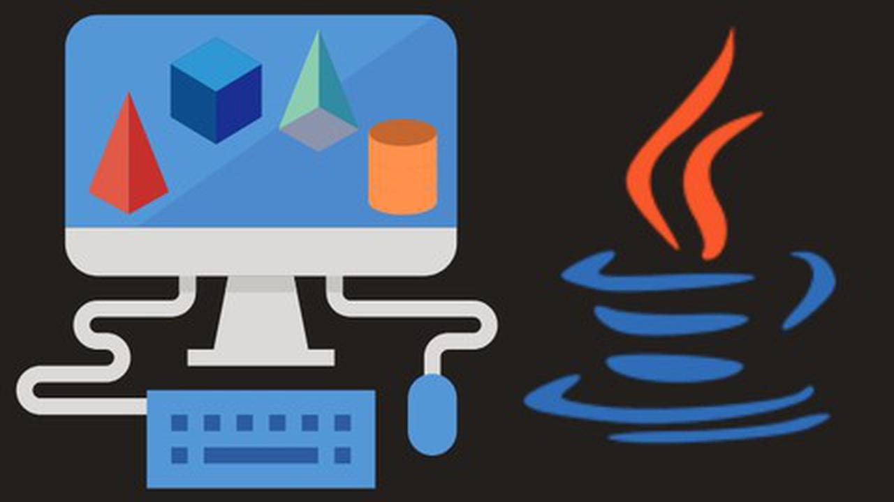

<body style = "color: #333">

# <span style="color: #FF4767;">**Clase 1**</span>

**Fecha:** 07 de noviembre 2023

***Nota:*** *Para la clase de programación II, es recomendable practicar (jugar) mecanografía*

# <p style="text-align: center;"><span style = "color: #007ACC;">IDE Visual Studio Code</span> [](https://code.visualstudio.com/) 
 </p>

## ¿Qué es?

Visual Studio Code es un editor de código fuente y de código abierto.
Destaca por ser multiplataforma y será el utilizado en esta materia.

### <span style = "color: #007ACC;">PASOS PARA EL FUNCIONAMIENTO DEL IDE

0. Se instaló el jdk en oracle.
1. Se instaló gitbash.
2. Se instaló el VSCode.
3. Se creó una cuenta de github.
4. Se integró la cuenta github al VSCode.
5. Consola.

### <span style= "color: #007ACC;">Configuración de VSCode</span>

+ Se vinculó la cuenta de GitHub dentro de VSCode para poder trabajar en la nube.
+ Se creó una carpeta para la materia en OneDrive para poder trabajar.
+ Dentro de esta se creó una carpeta ***.md*** para trabajar MarkDown, misma que permitirá llevar los **apuntes** de la clase.
+ Dentro de VSC es necesario instalar las respectivas *extensiones* para que se pueda trabajar en los proyectos de acorde a sus lenguajes.
+ Se instaló la extensión llamada **(Extension Pack for Java)**.

## Consola

### ¿Qué es?

La consola o terminal, es una interfaz de línea de comandos que permite inteactuar a los usuarios con el sistema operativo.

### ¿Por qué configurarla?

Es recomendable personalizarla para que el ambiente sea más acogedor debido a que se trabajará en ella frecuentemente.

### ¿Cómo configurarla?

Para hacerlo más amigable con el usuario se utilizará:

+ [Oh my posh]

[Oh my posh]: ttps://ohmyposh.dev
Dentro de este se encuentran las instrucciones para personalizar el terminal tanto de PowerShell como el Gitbash, permitiéndole personalizar:

+ Tipografía: JetBrains Mono, MesloLGL Nerd Font
+ Theme
+ Icons

Los cambios efectuados en estos, se verán contemplado en VSCode.

---------------------------

workdirectory: workspace --> directorio de trabajo

---------------------------

# <span style ="color: #FF4767;">**Clase 2**</span>

**Fecha:** 08 de noviembre de 2023

## <span style = "color: #007ACC;"> Mejores comandos parra VSC</span>

1. Papeleta de Comandos: **CTRL + SHIF + P**

    Y escribir "Abreviatura de comandos"
2. Abrir terminal: **CTRL + J**
3. Quick Open: **CTRL + P**

    Esto servirá para cambiar entre archivos.
4. Togle Sidebar: **CTRL + B**

    Abrirá y cerrará rápidamente el menú lateral izquierdo (esqueleto).
5. Multi cursor (Multi-Select): **CTRL + D, CTRL + F2**

    Con este se crearán cursores en diversas líneas de donde se tenga la palabra seleccionada.

    Es importante recalcar que **CTRL + F2** realizará el cambio en todo el documento.
6. Cortado matricial: **ALT + SHIFT RATÓN**

    Es importante poner el cursor en el prinicipio, aplastar el cortar y posteriormente marcar hasta el final, siendo así que cortará en forma de matriz.
7. Copy Line: **SHIFT + ALT + UP or SHIFT + ALT + DOWN**

    Repetirá la linea seleccionada en dirección a la cual se le haya indicado con el *up* y *down* del teclado.

8. Mover la linea seleccionada: **ALT + UP or DOWN**

    Moverá la línea o bloque seleccionado en dirección que se le indique.
9. Comentar en bloque (Multi-Line): **ALT + SHIFT +A**

    Comenta en forma varias línea al mismo tiempo
    
    *Ejemplo:*

        /* código escrito
            código escrito */
    No se puede descomentar en forma de comando.
10. Comentar una línea (Single line): **CTRL + K + C**
    Comenta como si fuera una sola línea (puede funcionar seleccionando varias líneas).

    Para **descomentar** la o las líneas se utilizará **CTRL + K+ U**.

11. Line cut : **CTRL + X**
12. Vista previa lateral: **CTRL + K + V**
13. Cerrar: **CTRL +F4**
14. Dividir pantalla: **CTRL + SHIFT + 5**
15. <span style = "color: #FF0000">**CERRAR UN PROCESO EJECUTADO:**</span> **CTRL + C**

# <p style="text-align: center; margin: 0 auto;"><span style = "color: #0000FF">**MarkDown**  <td><a href="#"></a></td>
</span>
</p>
Es un lenguaje de marcado donde se le puede agregar formato a documentos de texto plano.

## 2.0 <span style ="color: #0000FF"> **Comandos principales** </span>

### 2.1 <span style = "color: #0000FF;">Textos</span>

| Funcionalidad  | Símbolo | Muestra|
|---|---|---|
| Título Grande | # |
| Título Mediano  | ##   |
|   Título Pequeño | ###  |
| Palabras en negrita | **palabra**  | **palabra**|
| Palabras en cursiva | *palabra* |*palabra*|
|Palabras en negrita y cursiva|***palabra***| ***palabra***|
| Texto tachado | ~~  Texto  ~~ |~~Texto~~|

**Nota**: Los títulos no se pueden mostrar debido a que no cumple con las reglas de MD al mostrarlo así.

### 2.2 <span style = "color: #0000FF;">Enlaces

Para crear enlaces, encierra el texto del enlace entre corchetes [] y luego coloca la URL del enlace entre paréntesis ().

*Ejemplo*:

    [Texto del enlace](http://www.ejemplo.com)

### 2.3 <span style = "color: #0000FF;">Imágenes

Para insertar imágenes, se agrega un signo de exclamación (!) al principio.

*Ejemplo*:
       ! [Texto alternativo] (ruta/imagen.jpg)

### 2.4 <span style= "color: #0000FF;"> Tablas

#### Estructura

Utiliza el carácter de barra vertical (|) para separar las columnas y los guiones (-) para definir la línea de encabezado y separar las filas de la tabla. Por ejemplo:

| Encabezado 1 | Encabezado 2 | Encabezado 3 |
| ------------ | ------------ | ------------ |
| Dato 1      | Dato 2      | Dato 3      |
| Dato 4      | Dato 5      | Dato 6      |

#### Alineación de las columnas

Puedes alinear el texto en las columnas utilizando dos puntos ( `:` ) antes o después del guion de separación. Por ejemplo, :--- alinea a la izquierda, ---: alinea a la derecha y :---: alinea al centro. Por ejemplo:

| Alineado a la izquierda | Alineado al centro | Alineado a la derecha |
| :--------------------- | :----------------: | -------------------: |
| Dato 1                 |      Dato 2        |             Dato 3   |
| Dato 4                 |      Dato 5        |             Dato 6   |

### 2.5 <span style = "color: #0000FF;">Código

Para crear código en una línea utiliza el acento grave (`). Por ejemplo:

`var nombre = "John";`.

### 2.6 <span style = "color: #0000FF;">Insertar colores

Para insertar colores al texto será necesario escribir de la siguiente manera:

`<span style="color: #RRGGBB;">Este texto es de color #RRGGBB</span>`

La sintaxis general para ponerle colores al texto Markdown es la siguiente:

<span style="color: #RRGGBB;">Este texto es de color #RRGGBB</span>
Utiliza el código con precaución. Más información

**Donde:**

`#RRGGBB` es el valor hexadecimal del color.
El valor hexadecimal del color está compuesto por dos pares de números hexadecimales, cada uno de los cuales representa un componente del color:

+ R (rojo): 00 a FF
+ G (verde): 00 a FF
+ B (azul): 00 a FF

**EJEMPLO:**
|COLOR|SINTÁXIS|VISUALIZACIÓN|
|-----|------|---|
|Blanco|    #FFFFFF   |<span style="color: #FFFFFF;">Este texto es blanco</span>|
|Rosa pastel|    #FFF0F5   |<span style="color: #FFF0F5;"> Este texto es rosa pastel</span>|
| **Verde** | #F0FFF0, #CCFFCC  | <span style="color: #F0FFF0;">Verde lima</span> <span style="color: #CCFFCC;">Verde pastel</span>|
|Verde|   #00FF00   |<span style="color: #00FF00;">Este texto es verde</span>|
| **Amarillo** | #FFFFE0, #FFFACD | <span style="color: #FFFFE0;">Amarillo pastel</span>, <span style="color: #FFFACD;"> Amarillo claro</span>|
|Lavanda pastel|    #E0FFFF   |<span style="color: #E0FFFF;">Este texto es lavanda pastel</span>|
| **Azul** | #B2FFFF, #AFEEEE | <span style="color: #B2FFFF;">Azul pastel</span>`,`<span style="color: #AFEEEE;">Azul cielo</span> |
|Cian|     #00FFFF   |<span style="color: #00FFFF;">Este texto es cian</span>|
|Azul|    #0000FF  |<span style="color: #0000FF;">Este texto es azul</span>|
|Magenta|   #FF00FF   |<span style="color: #FF00FF;">Este texto es magenta</span>|
|Naranja pastel|     #FFE0B2    |<span style="color: #FFE0B2;">Este texto es naranja pastel</span>|
|Amarillo|     #FFFF00    |<span style="color: #FFFF00;">Este texto es amarillo</span>|
|Naranja brillante|    #FF7F45   |<span style="color: #FF7F45;">Este texto es naranja más brillante</span>|
| Naranja más fuerte| #FF9F00 | <span style="color: #FF9F00;"> Naranja mas fuerte</span>|
|Naranja fuerte|     #FF7F00   |<span style="color: #FF7F00;">Este texto es naranja fuerte</span>|
| **Rojo** | #FF0000|<span style="color: #FF0000;">Rojo</span>|
| **Gris** | #EEEEEE, #D3D3D3 | <span style="color: #EEEEEE;">Gris claro</span>`,`<span style="color: #D3D3D3;">Gris oscuro</span> |
|Negro|    #000000   |<span style="color: #000000;">Este texto es negro</span>|

# <span style = "color: #FF4767;">**Clase 3**</span>

**Fecha:** 9 de noviembre de 2023

# <p style="text-align: center; margin: 0 auto;"> <span style = "color: #FF7F45;">**GIT**</span> [](https://git-scm.com/)</p>

## ¿Qué es?

Es un sistema de control de versiones distribuido que permite a los desarrolladores rastrear los cambios en los archivos y el código fuente. Permitiendo hacer un seguimiento del código.

## <span style = "color: #FF7F45;">**Intrducción Git**

|COMANDOS| FUNCIONALIDAD|
|---|---|
|***git config --global user.name "nombre"***|Crea tu usuario con el nombre que le indiques|
|***git config --global user.email [email]***|Valida tus credenciales con tu email|
|***git config user.name***|Verificar la **identidad** del usuario|
|***git config user.email***|Verificar el **email** del usuario|
|***git init***|Inciacializar repositorio se liga con el branch master|
|***git add***| Añadir todo lo que hay en el directorio actual|
|***git add fileName.ext***|Agrega el documento indicado|
|***git status***|Revisa las condiciones en las que estás trabajando, es decir *(commits or branch master)*.|
|***git reset***|Se utiliza para restablecer el estado del repositorio de Git a un punto anterior en el historial. Puede utilizarse para deshacer cambios locales, descartar commits o volver a una rama anterior.|
|***git rm --cached git rm --cached***|Esto para quitar el documento seleccionado que se agregó|
|***git commit-m "C1: prj-start"***|Inicia el commit,  es una instantánea de los cambios realizados en un proyecto. Cada commit contiene archivos modificados,cambios realizados en cada archivo, mensaje de confirmación|
|***git branch "master"***|Renombrar la rama master a "main"|
|***git switch  "NameBranch"***|Se cambia a la rama indicada|
|***git branch***|Muestra cuantas ramas existen y en que rama nos encontramos con un (*), considerar que esta se crea con todo el contenido que se tiene|
|***git log***|Para ver el historial de cambios|

Cada que se agrega un archivo, estos se agregan a una rama main, esto se llama **BRANCH**

    >---- branch --- git:(master / main)
            Archivos a comitear
            o
            Archivos no agregados

#### Commit

El nombre del código se encuentra resaltado

[master (root-commit) **ac362b4**] C1: prj-star

Y este se vera modificado con cada commit y su respsectivo comentario

Recuerda que debes hacer un solo documento, no varios

# <p style="text-align: center; margin: 0 auto;"> <span style = "color: #FF9F00 ;">**GitBash**</span></p>

## <span style = "color: #FF9F00;">¿Qué es GitBash?</span>

+ Es una aplicación de línea de comandos que proporciona una interfaz de usuario para el sistema de control de versiones Git.
+ Es una herramienta que le permite interactuar con Git desde la línea de comandos.

## <span style = "color: #FF9F00;">¿Qué es **Linux**?</span>

Es un sistema operativo de código abierto y gratuito que se basa en el núcleo Linux. El núcleo Linux es el software que gestiona directamente el hardware de un sistema y sus recursos, como la CPU, la memoria y el almacenamiento

---
<span style = "color: #FF9F00;">**Dato curioso:**</span> Linux  y Gitbash fue creado por Linus Torvalds.

Por ello GitBash es un acercamiento a Linux.

---

## <span style = "color: #FF9F00; ">**Introducción de Linux**</span>

|COMANDOS| FUNCIONALIDAD|
|---|---|
|***pwd***|ver el directorio actual (dir. actual)|
|***tab***|Autocompletar|
|***cd***|Volver al directorio, con **ctrl+a, e** edita el nombre el fichero|
|***cd "nombreArchivo"/***|Entra al archivo|
|***cd ..***|Entra al archivo **ctrl+a, e** edita el nombre el fichero|
|***ls***|Listado del fichero con **ctrl +r** (buscar)|
|***ls-l***|Listado del fichero (vertical) **ctrl +r** (buscar)|
|***touch file.txt***|Crea un fichero|
|***echo "Texto a imprimir" >> fileNAME.extension***|Se utiliza para imprimir texto en la terminal de Git Bash|
|***cat file.txt***|Permite visualizar el contenido de los archivos en la terminal de Git Bash. **ctrl + l o clear** (limpiar la terminal)|
|***rm archivo.txt***| Elimina el archivo|
|***rm -r carpeta1***|Eliminar un directorio|
|***rm archivo1.txt archivo2.txt***|Eliminar varios archivos|
|***rm -r carpeta1/***|Eliminar un archivo de forma recursiva|
|***rm -i archivo.txt***|Eliminar un archivo de forma segura|
|***cp file.txt newfile.txt***|Copiar |
|***mv file.txt newfile.txt***|Renombrar|
|***ls -a***|Se utiliza para listar todos los archivos y directorios, incluidos los archivos ocultos, en la terminal|

<Span style = "color: #FF0000">**Para terminar un proceso Cntrl + c**</Span>

# <p style="text-align: center; margin: 0 auto;"><span style = "color: #F7F"> **GitHub** <td><a href="#"> </a></td></span></p>

## ¿Qué es?

Es una plataforma de desarrollo de código fuente que facilita a los desarrolladores colaborar en proyectos de código. Ademas de ser una herramienta para colabarar en codigo.

### <span style = "color: #F7F">**Elementos**</span>

+ <span style = "color: #F7F" >Repositorios de código:</span> Los repositorios de código son el lugar donde los desarrolladores almacenan y administran su código fuente. Los repositorios de GitHub se pueden compartir públicamente o privadamente.
+ <span style = "color: #F7F" > Control de versiones:</span> Utiliza el sistema de control de versiones Git para realizar un seguimiento de los cambios en el código fuente. Esto permite a los desarrolladores restaurar versiones anteriores del código y colaborar en cambios sin sobrescribirse entre sí.
+ <span style = "color: #F7F" >Foros:</span> Proporciona foros para que los desarrolladores puedan discutir sobre proyectos y pedir ayuda.
+ <span style = "color: #F7F" >Issues:</span> Proporciona una función de Issues para que los desarrolladores puedan informar de errores y solicitar nuevas funciones.
+ <span style = "color: #F7F" >Pull requests:</span> Proporciona una función de Pull requests para que los desarrolladores puedan solicitar que sus cambios se incorporen a un proyecto.

# <span style="color: #FF4767;">**Clase 4**</span>

**Fecha:** 10 de noviembre 2023

# <p style="text-align: center; margin: 0 auto;"><span style = "color: #FF7F00 ;"> **JAVA** <a href="#"> </a> </td></span></p>

## <span style = "color: #FF7F00 ;">Origen</span>

El equipo original de la empresa estaba formado por James Gosling, Eric Schmidt, John Gaga, Patrick Naughton y Wayne Rosing.

El proyecto fue dirigido por James Gosling, quien se inspiró en su trabajo en el lenguaje de programación C++, que era un lenguaje poderoso pero complejo. Gosling quería crear un lenguaje que fuera más fácil de aprender y usar, pero que aún así fuera potente y capaz.

El nombre "Java" proviene de la isla de Java, en Indonesia. Gosling quería un nombre que fuera corto, fácil de recordar y que evocara una sensación de exotismo y aventura.

## <span style = "color: #FF7F00;">**¿Qué es?**</span>

 Es un lenguaje de programación multiplataforma, seguro y orientado a objetos que se utiliza para crear una amplia gama de aplicaciones.

## <span style = "color: #FF7F00;">**¿Para qué sirve?**</span>

Su finalidad es crear software para una amplia gama de dispositivos y plataformas. Es un lenguaje de programación multiplataforma, lo que significa que el código escrito en Java se puede ejecutar en cualquier plataforma que tenga instalada la Máquina Virtual Java (JVM). Esto hace que Java sea una opción popular para el desarrollo de aplicaciones móviles, ya que las aplicaciones Java se pueden ejecutar en dispositivos Android, iOS y Windows Phone.

+ <span style = "color: #FF7F00;" >Multiplataforma:</span> El código escrito en Java se puede ejecutar en cualquier plataforma que tenga instalada la JVM.
+ <span style = "color: #FF7F00;">Seguro:</span> Java está diseñado para prevenir errores y ataques maliciosos.
+ <span style = "color: #FF7F00;">Versátil:</span> Se puede utilizar para crear una amplia gama de aplicaciones.

## <span style = "color: #FF7F00;">Elementos</span>

 1. <span style = "color: #FF7F00;">Paquetes:</span> Son una forma de organizar el código en Java. Un paquete es un conjunto de clases que están relacionadas entre sí.
2. <span style = "color: #FF7F00;">Clases:</span> Son la unidad básica de construcción en Java. Una clase define un tipo de dato, que puede ser utilizado para crear objetos.
3. <span style = "color: #FF7F00;"> Objetos:</span> Son instancias de clases. Un objeto tiene sus propios datos y métodos.
4. <span style ="color: #FF7F00;">Métodos:</span> Son las acciones que pueden realizar los objetos.
5. <span style = "color: #FF7F00;">Variables:</span> Se utilizan para almacenar datos.
6. <span style = "color: #FF7F00;">Constantes:</span> Las constantes son variables que no pueden cambiar su valor.
7. <span style = "color: #FF7F00;">Operadores:</span> Los operadores se utilizan para realizar operaciones matemáticas y lógicas.
8. <span style = "color: #FF7F00;" >Sentencias:</span> Las sentencias son instrucciones que se ejecutan en Java.

## <span style = "color: #FF7F00;">Estructura</span>

    proyecto
        paquete
            src
                clase
                    metodos
                    variables
                    constantes

### <span style = "color: #FF7F00;"> Estructura del codigo</span>

El código debe estar bien estructurado y organizado. Se recomienda utilizar sangrías y espacios en blanco para mejorar la legibilidad del código.

La clase main es la clase que se ejecuta cuando se inicia un programa Java. La sintaxis de una clase main en Java es la siguiente:

``` java
public class Nombre_de_la_clase{
    public static void main(String[] args){

        /* Methods
        *  Variables
        *  Constantes
        */
    }
}
```
+ La palabra clave `public`: indica que la clase es accesible desde cualquier parte del programa.

+ La palabra clave `class`: indica que se está declarando una clase.

+ El nombre de la clase: es una cadena de caracteres que identifica a la clase.

+ La palabra clave `public`: indica que el método main es accesible desde cualquier parte del programa.

+ La palabra clave `static`: indica que el método main no está asociado a ningún objeto.

+ La palabra clave `void`: indica que el método main no devuelve ningún valor.

+ El nombre del método: es una cadena de caracteres que identifica al método.

+ Los argumentos: son los datos que se pasan al método main cuando se llama. Los argumentos pueden ser de cualquier tipo de dato.

+ El cuerpo del método: es el código que se ejecuta cuando se llama al método main.

<span style = "color: #FF0000;">***IMPORTANTE:***</span>

+ La clase `main` es una parte esencial de cualquier programa Java. Es la clase que inicia el programa y ejecuta su código.

+ El codigo siempre debe contener esa <span style = "color: #FF7F00;">estructura</span> para que funcione el programa. Por ello es importante que las llaves <span style = "color: #FF0000;">**{ }**</span> se encuentren bien colocadas, caso contrario nos arrojara un problema.

+ Ademas de siempre controlar cada linea de codigo con un <span style="color:#FF0000;">**;**</span> para que valide aquella linea.

*Ejemplo:*


## <span style ="color: #FF7F00;">Console commands</span>

|Command|Funcionalidad|
|------|-----|
|java ***nombre del archivo.java***|Compila el programa en consola|
|cat ***nombre del archivo.java***|Muestra lo que tiene el archivo escrito|

# <span style = "color: #FF4767;"> **Clase 5**</span>
**Fecha:** 14 de noviembre 2023


**Nota:** Cuando se habla de creación de procedimiento se habla de una programación estructurada.

<span style = "color: #FF7F00">Dato curioso:</span> El area mejor pagada dentro de JAVA es Java EE.

## <span style = "color: #FF7F00"> **Estructuras de control**</span>

Son instrucciones que permiten alterar el flujo normal de ejecucion de un programa. Existen tres tipos de estructuras:

### <span style = "color: FF7F00"> Estructuras de selección:</span>
Estas estructuras permiten ejecutar un bloque de código dependiendo de si se cumple o no una condición

1. if-else:

    Esta estructura permite ejecutar un bloque de código si se cumple una condición, o un bloque diferente de código si no se cumple la condición.

    ```java
    int numero = 10;

    if (numero > 5) {
      System.out.println("El número es mayor que 5");
    } else {
      System.out.println("El número es menor o igual que 5");
    }
    ```

2. Switch:

    Esta estructura permite ejecutar un bloque de código diferente en función del valor de una variable.

    ```java
    int dia = 2;

    switch (dia) {
      case 1:
        System.out.println("Es lunes");
        break;
      case 2:
        System.out.println("Es martes");
        break;
      default:
        System.out.println("No es un día de la semana");
        break;
    }

    ```


### <span style = "color: FF7F00"> Estructuras de iteración: </span>
Estas estructuras permiten ejecutar un bloque de código repetidamente
+ For:

    Esta estructura permite ejecutar un bloque de código un número determinado de veces.

    ```java
    for (int i = 0; i < 10; i++) {
    System.out.println(i);
    }
    ```

+ While:
    Esta estructura permite ejecutar un bloque de código mientras se cumpla una condición.
    ```java
    int i = 0;

    while (i < 10) {
    System.out.println(i);
    i++;
    }
    ```

+ Do-while:

    Similar a la estructura while, pero el bloque de código se ejecuta al menos una vez, incluso si la condición no se cumple.

    ```java
    int i = 0;

    do {
      System.out.println(i);
      i++;
    } while (i < 10);
    ```

### <span style = "color: #FF7F00">Estructuras de salto:</span>
Estas estructuras permiten saltar a una instrucción específica en el código.

+ **Break:**

    Permite salir de un bucle.
    ```java
    for (int i = 0; i < 10; i++) {
      if (i == 5) {
        break;
      }

      System.out.println(i);
    }
    ```

+ **Continue:**

    Permite pasar a la siguiente iteración de un bucle.
    ```java
    for (int i = 0; i < 10; i++) {
      if (i == 5) {
        continue;
      }

      System.out.println(i);
    }
    ```

+ **Return:**

    Permite salir de una función y retornar un valor en especifico.
    ```java 
    public int sumar(int a, int b){
      if (a < 0 || b < 0) {
        return -1;
      }

      return a + b;
    }
    ```

## <span style = "color: #FF7F00"> METODOS </span>

Es un bloque de código que se puede llamar desde cualquier parte del programa.

Se utilizan para realizar tareas específicas, como calcular una suma, mostrar un mensaje o leer un archivo.

La estructura de un método en Java es la siguiente:

``` java
[ modificadores ] tipo_de_retorno nombre_del_metodo([ argumentos ]) {
  // código del método
}
```

Los modificadores son opcionales y se utilizan para controlar el acceso al método. Los tipos de modificadores que se pueden utilizar son:

+ **public:** el método es accesible desde cualquier parte del programa.

+ **protected:** el método es accesible desde la misma clase y sus subclases.

+ **private:** el método solo es accesible desde la misma clase.

El tipo de retorno es el tipo de dato que se devuelve por el método. Si el método no devuelve ningún valor, el tipo de retorno es `void`.

El *nombre* del método es una cadena de caracteres que identifica al método.

Los *argumentos* son los datos que se pasan al método cuando se llama. Los argumentos pueden ser de cualquier tipo de dato.

El *cuerpo* del método es el código que se ejecuta cuando se llama al método.

*Ejemplo:*

```java
public int sumar(int a, int b) {
  return a + b;
}
```

Este método se llama `sumar` y tiene dos argumentos, `a` y `b`. El tipo de retorno del método es `int`, que indica que el método devuelve un valor de tipo entero. El cuerpo del método simplemente suma los valores de los argumentos y devuelve el resultado.

Pueden tener cualquier número de argumentos y cualquier tipo de retorno.

Se pueden utilizar para modularizar el código y hacerlo más fácil de entender y mantener. También se pueden utilizar para reutilizar el código en diferentes partes del programa.

Se pueden utilizar en:

+ Para calcular una suma.
+ Para mostrar un mensaje.
+ Para leer un archivo.
+ Para validar los datos de un usuario.

## <span style = "color: #FF7F00"> **CLASE** </span>

Es una plantilla que define la forma de un objeto.Usa una especificación de clase para construir objetos

``````java
class NombreDeLaClase {

  // Declaraciones de variables

  // Declaraciones de métodos

}
``````

En Java, una clase es una plantilla que define la forma de un objeto. Especifica los datos y el código que operará en esos datos. Java usa una especificación de clase para construir objetos. Los objetos son instancias de una clase.

Una clase se define utilizando la palabra clave class. La sintaxis de una clase en Java es la siguiente:

````Java
class NombreDeLaClase {

  // Declaraciones de variables

  // Declaraciones de métodos

}
````

Utiliza el código con precaución. Más información
Las declaraciones de variables definen los datos que almacenará la clase. Las declaraciones de métodos definen las acciones que puede realizar la clase.

**Ejemplo:**

``````java
class MiClase {

  // Declaraciones de variables
  int numero;
  String nombre;

  // Declaraciones de métodos
  public void saludar() {
    System.out.println("Hola, mi nombre es " + nombre);
  }

}
``````

Para crear un objeto de una clase, se utiliza la palabra clave new. La sintaxis para crear un objeto de una clase es la siguiente:

``````java
NombreDeLaClase objeto = new NombreDeLaClase();
``````

## <span style = "color: #FF7F00">Comparacion entre clase y metodo</span>

|Característica|Clase|Método|
|----|----|----|
|Definición|Plantilla que define la forma de un objeto|Bloque de código que se puede llamar desde cualquier parte del programa.|
|Datos|Almacena datos|No almacena datos|
|Código|Define acciones que puede realizar la clase|Ejecuta acciones|
|Acceso|Puede ser privado, protegido, público o por defecto|Puede ser público, protegido o privado|
|Instancias|Puede crearse una instancia de la clase|No se puede crear una instancia de un método|

Por ejemplo, la siguiente clase define una clase llamada Persona con dos variables, nombre y edad, y un método, saludar():

```java
class Persona {

  // Declaraciones de variables
  String nombre;
  int edad;

  // Declaraciones de métodos
  public void saludar() {
    System.out.println("Hola, mi nombre es " + nombre);
  }

}
```
# OPERADORES

|Operator|Name|Example|
|---|---|---|
|+|Adicion|x + y|
|-|Reduccion|x - y|
|*|Multiplicacion|x * y|
|/|División|x / y|
|%|Módulo|x % y|
|++|Incremento|++x|
|--|Decremento|--x|
|&& |Y|Logical and x < 5 && x < 10|
| l l | O | Logical or x < 5 l l x < 4|
|!| Logical not| !(x < 5 && x < 10)|
|==| Equal to| x == y|
|!=| Not equal| x != y|
|> |Greater than |x > y|
|< |Less than |x < y|
|>=| Greater than or equal to| x >= y|
|<=| Less than or equal to |x <= y|

## Otros operadores
|Operator| Example| Same As|
|---|---|---|
|= |x = 5| x = 5|
|+=|x += 3 |x = x + 3|
|-=| x -= 3| x = x - 3|
|*=| x *= 3| x = x * 3|
|/=| x /= 3| x = x / 3|
|%=| x %= 3| x = x % 3|
|&=| x &= 3| x = x & 3|
|l=| x l= 3| x = x l 3|
|^=| x ^= 3 |x = x ^ 3|
|>>= |x >>= 3 |x = x >> 3|
|<<= |x <<= 3 |x = x <<|

## <span style = "color: #FF7F00;">**PROGRAMACION ORIENTADA A OBJETOS (POO)**</span>

Es un paradigma de programación que organiza el código en torno a objetos. Son entidades que tienen estado y comportamiento. El estado de un objeto se representa mediante variables, y el comportamiento de un objeto se representa mediante métodos.

Un ejemplo de la vida cotidiana de la POO es una persona. Una persona tiene estado, como su nombre, edad y dirección. También tiene comportamiento, como caminar, hablar y comer.

La clase `Persona` tendría variables para almacenar el estado de la persona, como su nombre, edad y dirección. También tendría métodos para representar el comportamiento de la persona, como caminar, hablar y comer.

Por ejemplo, la clase `Persona` podría tener las siguientes variables:

+ `nombre`: El nombre de la persona
+ `edad`: La edad de la persona
+ `direccion`: La dirección de la persona

También podría tener los siguientes métodos *(acciones)*:

+ `caminar()`: Hace que la persona camine
+ `hablar()`: Hace que la persona hable
+ `comer()`: Hace que la persona coma

Otros ejemplos:

+ Un automóvil es un objeto que tiene estado, como su color, modelo y año. También tiene comportamiento, como conducir, frenar y girar.
+ Una casa es un objeto que tiene estado, como su tamaño, número de habitaciones y ubicación. También tiene comportamiento, como proporcionar refugio, seguridad y comodidad.
+ Una computadora es un objeto que tiene estado, como su procesador, memoria y almacenamiento. También tiene comportamiento, como ejecutar programas, almacenar datos y conectarse a Internet.


# <Span style = "color: #FF4767;">**Clase 6**</Span>

**Fecha:** 16 de noviembre 2023

### <span style = "color: #FF7F00">Compilador de Java</span>

El compilador de Java es un programa informático que traduce el código fuente escrito en Java a código de máquina, que es un conjunto de instrucciones que puede ser ejecutado directamente por la computadora.

### <span style = "color: FF7F00;">Instancia</span>

Una instancia es un objeto concreto creado a partir de una clase, es decir, una representación específica de una clase. Tiene un estado y un comportamiento definidos por la clase a la que pertenece

Por ejemplo, la clase `Persona` podria tener las siguientes variables de instancia:

+ `nombre: ` Nombre de la persona.
+ `edad: ` Edad de la persona.

Las instancias se crean utilizando el operador new. Por ejemplo:

```java
Persona persona = new Persona();
```

Este código crea un objeto de la clase `Persona` con el estado y el comportamiento predeterminados de la clase `Persona`.

Los objetos en Java pueden acceder a sus datos y métodos mediante el operador de acceso `[.]`. Por ejemplo, el siguiente código imprime el nombre de una persona:

```java
Persona persona = new Persona();
persona.nombre = "Juan Pérez";

System.out.println(persona.nombre); // Imprime "Juan Pérez"
```

### <span style = "color: #FF7F00;">Debugger</span>

Es una herramienta de desarrollo de software que permite a los desarrolladores encontrar y corregir errores en el código fuente. Los depuradores proporcionan una variedad de funciones que ayudan a los desarrolladores a comprender cómo se ejecuta el código y a identificar los problemas.

Funciones básicas de un depurador:

+ Pausar la ejecución del código.
+ Navegar por el código.
+ Examinar los valores de las variables.
+ Ejecutar el codigo paso a paso

### <span style = "color: #FF7F00">Constructor</span>

Es un método especial que se utiliza para inicializar un objeto recién creado. El constructor se llama cuando se crea una instancia de una clase.

#### Caracteristicas
+ Tiene el mismo nombre de la clase.
+ Se ejecutra un unica vez.
+ Debe ser publico.
+ Puede ayudar inicializando las variables.
+ Puede haber mas de un constructor en la clase.

### <span style = "color: #FF7F00;">Creacion de la clase</span>

Dentro de una clase se pueden crear metodos o funciones para llamarlos dentro de la propia clase, pero lo ideal en POO es crear un `Proyecto Java`, donde se van a crear todas las clases y se las llamaran a una `clase Main`.

Por ello lo recomendable es crear un archivo especifico para almacenar el proyecto con el comando

1. Ctrl + Shift + N.
2. Ctrl + Shift + P.
3. Create Java Project.
4. No build tools (Depende de lo que se quiera hacer).
5. Seleccionar el espacio (carpeta) para almacenar.
6. Darle un nombre al proyecto.

De esta manera se crea una estructura de proyecta Java, ejemplo:


# <span style = "color: #FF4767;">**Clase 7**</span>

**Fecha:** 21 de noviembre

## <span style = "color: #FF7F00"> BUCLES </span>

Es una estructura de control que permite ejecutar un bloque de código repetidamente. Los bucles se utilizan para realizar tareas que deben repetirse un número determinado de veces, o mientras se cumpla una condición.

Siendo tres: for, while y do-while

#### <span style = "color: #FF7F00">**Sintaxis**</span>
1. **For:**

    ```java
    for (int i = 0; i < 10; i++) {
      System.out.println(i);
    }
    ```

    La inicialización se ejecuta una sola vez, al principio del bucle.<span style= "color: #FF7F00;"> **La condición se evalúa al principio de cada iteración del bucle**</span>.

    Si la condición es verdadera, se ejecuta el bloque de código. Si la condición es falsa, el bucle termina. El incremento se ejecuta al final de cada iteración del bucle.

2. **Do-while:**

    El bloque de código <span style = "color: #FF7F00;"> **se ejecuta al menos una vez**</span>, ***incluso*** si la condición no se cumple. La condición <span style = "color: #FF7F00;"> **se evalúa al final de cada iteración del bucle**</span>. Si la condición es verdadera, el bucle se repite. Si la condición es falsa, el bucle termina.

    ```java
    do {
      // bloque de código
    } while (condición);
    ```

3. **While:**

    La condición <span style="color: #FF7F00"> **se evalúa al principio de cada iteración del bucle**</span>. Si la condición es verdadera, se ejecuta el bloque de código. Si la condición es falsa, el bucle termina.

    ```java
    int i = 0;

    while (i < 10) {
      System.out.println(i);
      i++;
    }
    ```
### ¿Cuándo se utilizan estos ciclos?

  + El `for` se utiliza cuando se conoce el valor con el que se inicia, o cuando inicia y cuando este se va a detener.
  + El `while` se utiliza que ejecutará algo hasta que una condición cambie, pero yo no conozco cuando cambiará la condición de salida.
  + `DoWhile` se utiliza cuando se conoce de antemano que el bloque de instrucciones se ejecutará al menos una vez. Esto se debe a que el ciclo `do-while` evalúa la condición al final del bloque de instrucciones, por lo que el bloque de instrucciones se ejecutará al menos una vez, incluso si la condición es falsa.

Se utilizan en una amplia variedad de aplicaciones, incluyendo la creación de menús, la navegación por árboles y la generación de gráficos.

## <span style = "color: #FF7F00;">Tipos de variables</span>


+ <span style = "color: #FF7F00;">Variables primitivas:</span>
Almacenan valores de tipos de datos primitivos, como números, caracteres y booleanos. Son tipos de datos básicos que no son objetos. Los tipos de datos primitivos en Java son los siguientes:

    + byte: Almacena un número entero de 8 bits.
    + short: Almacena un número entero de 16 bits.
    + int: Almacena un número entero de 32 bits.
    + long: Almacena un número entero de 64 bits.
    + float: Almacena un número de coma flotante de 32 bits.
    + double: Almacena un número de coma flotante de 64 bits.
    + char: Almacena un carácter Unicode.
    + boolean: Almacena un valor lógico, true o false.
    + Variables de referencia

    

    <span style = "color: #FF0000">Nota:</span> Se recomienda utilizar camelCase,para nombrar variables.

+ <span style = "color: #FF7F00;">Variables de referencia:</span> Son variables que almacenan direcciones de memoria de objetos.

    Los objetos en Java son instancias de clases.

+ <span style = "color: #FF7F00 ">Variables locales:</span> Son variables que se declaran dentro del cuerpo de un método.
Variables primitivas

    Solo son visibles dentro del método en el que se declaran.

*Ejemplo:*

``````java
// Variable primitiva
int numero = 10;

// Variable de referencia
Persona persona = new Persona();

// Variable local
int contador = 0;
``````

+ En el primer ejemplo, la variable *numero* es una variable primitiva de tipo *int* que almacena el valor 10.
+ En el segundo ejemplo, la variable persona es una variable de referencia de tipo *Persona* que almacena la dirección de memoria de un objeto de la *clase Persona*.
+ En el tercer ejemplo, la variable *contador* es una variable local de tipo *int* que se declara dentro del método *main()*.

## <span style = "color: #FF7F00">**CASTEO** </span>
Un `cast` es una conversión de un tipo de dato a otro. Los casteos se pueden realizar de dos maneras:

### Casteo implícito

Se realiza automáticamente por el compilador de Java cuando un valor de un tipo de dato se asigna a una variable de otro tipo de dato. El compilador de Java realiza el casteo implícito de acuerdo con las siguientes reglas:

1. Un tipo de dato más pequeño se puede asignar a un tipo de dato más grande sin pérdida de información. Por ejemplo, un entero se puede asignar a un float o un double.
2. Un tipo de dato más grande se puede asignar a un tipo de dato más pequeño con pérdida de información. Por ejemplo, un float se puede asignar a un entero.

*Ejemplo:*
```java
int entero = 10;
float flotante = entero; // Casteo implícito de entero a flotante

String cadena = "Hola";
int numero = cadena.length(); // Casteo implícito de cadena a entero

```

 + El compilador de Java realiza el casteo implícito de `entero` a `flotante` sin pérdida de información.

+ El compilador de Java realiza el casteo implícito de `cadena` a `entero` con pérdida de información.

### Casteo explícito

El casteo explícito se realiza manualmente por el programador utilizando el operador (). El operador () se utiliza para indicar al compilador que se debe realizar un casteo explícito.

El casteo explícito se puede utilizar para realizar un casteo de un tipo de dato a otro, incluso si el compilador de Java no lo permite de forma implícita.

*Ejemplos:*

```java
int entero = 10;
byte byte1 = (byte) entero; // Casteo explícito de entero a byte

String cadena = "Hola";
char caracter = (char) cadena.charAt(0); // Casteo explícito de cadena a char

```

+ El compilador de Java no permite realizar un casteo implícito de `entero` a `byte`, por lo que se debe realizar un casteo explícito.
+ El compilador de Java no permite realizar un casteo implícito de  `cadena` a `char`, por lo que se debe realizar un casteo explícito.

## <span style = "color: #FF7F00;">**PARSEO**</span>

### ¿Qué es?

El parseo es el proceso de convertir una cadena de texto en un objeto de un tipo de datos específico.

### ¿Cómo se realiza?

Se pueden realizar utilizando métodos estáticos de las clases de tipos primitivos o clases de objetos de referencia.

### Algunos ejemplos de cómo se pueden utilizar los parseos en Java

1. <span style = "color: #FF7F00;">Entrada/salida de datos:</span> Los parseos se pueden utilizar para leer datos de un archivo o entrada del usuario y almacenarlos en variables. También se pueden utilizar para escribir datos de variables en un archivo o salida del usuario.

*Ejemplo 1:*

```Java
// Convertir una cadena de texto en un número entero

int numero = Integer.parseInt("10");

System.out.println(numero); // Imprime 10
`````

Este código convertirá la cadena "10" en un número entero y lo almacenará en la variable numero. Luego, imprimirá el valor de numero en consola.

2. <span style ="color: #FF7F00;">Validación de datos:</span> Los parseos se pueden utilizar para validar los datos ingresados por el usuario. Por ejemplo, podemos usar el método parseInt() para validar que un usuario ingrese un número entero válido.

*Ejemplo 2:*

```Java
// Validar que el usuario ingrese un número entero

Scanner sc = new Scanner(System.in);

System.out.println("Ingrese un número entero: ");
int numero = sc.nextInt();

if (numero < 0) {
  System.out.println("El número debe ser mayor o igual a 0.");
} else {
  System.out.println("El número es válido.");
}
```

Este código le pedirá al usuario que ingrese un número entero. Luego, usará el método parseInt() para convertir la entrada del usuario en un número entero. Si el número es menor que 0, el código imprimirá un mensaje de error. De lo contrario, el código imprimirá un mensaje de confirmación.

3. <span style ="color: #FF7F00;">Conversión de formatos de datos:</span> Los parseos se pueden utilizar para convertir datos de un formato a otro. Por ejemplo, podemos usar el método parse() para convertir una fecha en formato de cadena a formato de objeto Date.

*Ejemplo 3:*

```Java
// Convertir una fecha de cadena a objeto `Date`

String fechaEnCadena = "2023-12-02";

Date fecha = Date.parse(fechaEnCadena);

System.out.println(fecha); // Imprime 2023-12-02
```

Este código convertirá la cadena "2023-12-02" en una fecha y la almacenará en la variable fecha. Luego, imprimirá la fecha en consola.

## <span style = "color: #FF7F00;">Documentacion</span>

 Es un conjunto de documentos que proporcionan información sobre el código fuente de un programa Java. Esta documentación puede ser utilizada por desarrolladores, usuarios o cualquier otra persona que necesite entender el código.

Es una parte importante del desarrollo de software. Una buena documentación puede ayudar a otros desarrolladores a entender tu código y a utilizarlo de forma eficaz.

 ### <span sytle = "color: #FF7F00;">Con que se genera?</span>

 Utilizando el programa Javadoc. Javadoc es una herramienta que utiliza comentarios especiales en el código fuente para generar documentación HTML.

 ### <span sytle = "color: #FF7F00;">Sintaxis</span>

Comienzan con el símbolo `/**` y terminan con el símbolo `*/.` Dentro de estos comentarios, se pueden utilizar tags especiales para proporcionar información sobre el código.

Algunos de los tags más comunes utilizados en la documentación Java son:

+ @author: Se utiliza para indicar el autor del código.
+ @version: Se utiliza para indicar la versión del código.
+ @param: Se utiliza para indicar los parámetros de un método o constructor.
+ @return: Se utiliza para indicar el valor devuelto por un método.
+ @throws: Se utiliza para indicar las excepciones que puede lanzar un método.

*Ejemplo:*
```java
/**
 * Este método suma dos números.
 *
 * @param a El primer número.
 * @param b El segundo número.
 * @return El resultado de la suma.
 */
public int sumar(int a, int b) {
  return a + b;
}

```

### <span style = "color: #FF7F00;">Propositos:</span>

+ Mejorar la comprensión del código: La documentación puede ayudar a los desarrolladores a entender el código más rápidamente y fácilmente.
+ Facilitar el mantenimiento del código: La documentación puede ayudar a los desarrolladores a mantener y mejorar el código.
+ Mejorar la documentación de la API: La documentación en Java puede ser utilizada para documentar la API de un programa Java.

## <span style = "color: #FF7F00">Variables y secuencia escape</span>

|Secuencia de escape|Funcionalidad|
|----|----|
|\n|Representa una nueva línea.|
|\t|Representa un tabulador.|
|\r|Representa un retorno de carro.|
|\b|Representa un retroceso.|
|\'|Representa una comilla simple.|
|\"|Representa una comilla doble.|
|\ \ |Representa una barra invertida.|
|\f|Representa un salto de página.
|\uxxxx|Representa un carácter Unicode.|

*Ejemplo:*

```java
// Representa una nueva línea
System.out.println("Hola, mundo!\n");
````

***Imprime:*** Hola, mundo!

```java
// Representa un tabulador
System.out.println("Hola, \tmundo!");

```

***Imprime:***
Hola,  __  mundo!

```java

// Representa un retorno de carro
System.out.println("Hola,\rmundo!");
```

***Imprime:***

Hola,

mundo!

```java
// Representa un retroceso
System.out.println("Hola, \bmundo!");
```

***Imprime:***

Hola,

mundo!

```java
// Representa una comilla simple
System.out.println("El nombre del perro es \"Paco\".");
```

***Imprime:***
"El nombre del perro es \"Paco\"."

```java
// Representa una comilla doble
System.out.println("El nombre del perro es 'Paco'.");
```

***Imprime:***
'El nombre del perro es "Paco".'

```java
// Representa una barra invertida
System.out.println("La barra invertida es \"\\\\\".");
```

***Imprime:*** La barra invertida es "\".

```java
// Representa un salto de página
System.out.println("Página 1\fPágina 2");
```

***Imprime:***

Página 1

Página 2

```java
// Representa un carácter Unicode
System.out.println("El símbolo € se representa con el código Unicode 0x20AC.");
```
***Imprime:***
El símbolo € se representa con el código Unicode 0x20AC.

## <span style = "color: #FF7F00">Reglas para nombrar variables</span>

+ Los nombres pueden contener letras, dígitos, guiones bajos y símbolos de dólar.
+ Los nombres deben comenzar con una letra.
+ Los nombres deben comenzar con una letra minúscula y no pueden contener espacios en blanco.
+ Los nombres también pueden comenzar con `$` y `_` .
+ Los nombres distinguen entre mayúsculas y minúsculas ("`myVar`" y "`myvar`" son variables diferentes).
+ Las palabras reservadas (como las palabras clave de Java, como `int` o `boolean`) no se pueden usar como nombre

Recordar el uso de `camelCase`

# <span style = "color: #FF4767;">**Clase 8**</span>

***Fecha:*** 28 de noviembre

## Metodos String

|String|Funcion|
|---|---|
|.charAt(index) | Obtener un carácter|
|.Length()  |Obtener la longitud del string|
|.equalsIgnoreCase() | Ignorar si es mayúsculas o minúscula|
|.concat()|Concatenar dos cadenas. Devuelve una nueva cadena que es la combinación de las dos cadenas originales.|
|.equals()|Compara dos objetos|
|indexOf()|Devuelve el índice del primer carácter que coincide con el carácter o la cadena especificados.|
|.lastIndexOf()|Devuelve el índice del último carácter que coincide con el carácter o la cadena especificados.|
|.substring()|Devuelve una nueva cadena que es una subcadena de la cadena actual.|
|.replace()|Reemplaza todos los caracteres que coinciden con un carácter o una cadena especificados con otro carácter o cadena.|
|.trim()	|Elimina los espacios en blanco del principio y del final de la cadena.|
|.toLowerCase()|	Convierte la cadena a minúsculas.|
|.toUpperCase()|	Convierte la cadena a mayúsculas.|
|.compareTo()|	Compara la cadena actual con otra cadena, devuelve un valor negativo si la cadena actual es menor que la cadena especificada, un valor positivo si la cadena actual es mayor que la cadena especificada y un valor cero si las dos cadenas son iguales.|
|.compareToIgnoreCase()|Compara la cadena actual con otra cadena, ignorando las diferencias entre mayúsculas y minúsculas.|
|.contains()|Devuelve true si la cadena actual contiene la cadena especificada, false en caso contrario.|
|.startsWith()|Devuelve true si la cadena actual comienza con la cadena especificada, false en caso contrario.|
|.endsWith()|Devuelve true si la cadena actual termina con la cadena especificada, false en caso contrario.|
|.join()|Concatena una serie de cadenas, usando un carácter especificado como separador.|
|.split()|Divide la cadena actual en una matriz de cadenas, usando un carácter especificado como separador.|
|.valueOf()|Convierte un valor primitivo en una cadena.|

## Scanner

 Es una clase que se utiliza para leer datos de una fuente de entrada. La fuente de entrada puede ser la consola, un archivo o cualquier otro flujo de datos.

Proporciona una serie de métodos para leer datos de diferentes tipos. Por ejemplo, el método `nextInt()` lee un número entero, el método `nextDouble()` lee un número decimal y el método `nextLine()` lee una cadena de caracteres.

```java
Scanner scanner = new Scanner(System.in);

int numero = scanner.nextInt();

System.out.println(numero);

```
Este código imprimirá el número entero leído en la consola.

### Metodos Scanner

|Estructura|Funcion|
|-----|-----|
|nextInt()| Se salta los espacios dejados en blanco hasta que encuentra un valor de tipo int|
|nextLong()| Se salta los espacios dejados en blanco hasta que encuentra un valor de tipo long|
|nextFloat() |Se salta los espacios dejados en blanco hasta que encuentra un valor de tipo float|
|nextDouble()| Se salta los espacios dejados en blanco hasta que encuentra un valor de tipo double|
|next() |Se salta los espacios dejados en blanco hasta que encuentra un token. Devuelve el token como un valor tipo String.|

## <span style = "color: #FF7F00;">Unmutable</span>

Un objeto inmutable es aquel cuyo estado no se puede cambiar una vez que ha sido creado. Esto significa que los atributos de un objeto inmutable no se pueden modificar después de que el objeto haya sido creado.

### Ventajas

+ <span style = "color: #FF7F00;">Seguridad de concurrencia:</span> Los objetos inmutables son seguros para la concurrencia, ya que no se puede modificar su estado desde diferentes hilos.
+ <span style = "color: #FF7F00;">Eficiencia:</span> Los objetos inmutables son más eficientes que los objetos mutables, ya que no es necesario realizar copias del objeto para modificarlo.
+ <span style = "color: #FF7F00;">Facilidad de prueba:</span> Los objetos inmutables son más fáciles de probar que los objetos mutables, ya que no es necesario preocuparse por el estado del objeto.

### Clases inmutables

+ Las clases que representan tipos primitivos, como `int`, `float`, `char`, etc.
+ Las clases que implementan la interfaz `final`.
+ Las clases que no tienen métodos que modifiquen el estado del objeto.

Por ejemplo, la clase `String` es una clase inmutable. Esto significa que una vez que se crea una instancia de la clase String, su contenido no se puede modificar.

### Como crear clases inmutables

Para crear una clase inmutable, podemos seguir los siguientes pasos:

1. Declarar la clase como `final`. Esto evitará que la clase se herede de otras clases.
2. Declarar los atributos de la clase como `final`. Esto evitará que los atributos se modifiquen.
3. No proporcionar métodos que modifiquen el estado del objeto.

Por ejemplo, el siguiente código muestra una clase inmutable llamada `Persona`:

```java
public final class Persona {

    private final String nombre;
    private final int edad;

    public Persona(String nombre, int edad) {
        this.nombre = nombre;
        this.edad = edad;
    }

    public String getNombre() {
        return nombre;
    }

    public int getEdad() {
        return edad;
    }
}

```

Esta clase tiene dos atributos, nombre y edad, que se declaran como final. Además, la clase no proporciona ningún método que modifique el estado del objeto.

## <span style = "color: #FF7F00;">StringBuilder</span>

Es una clase en Java que se utiliza para manipular cadenas. Es una clase mutable, lo que significa que su contenido se puede cambiar después de su creación.

Proporciona una serie de métodos para manipular cadenas, entre ellos:

+ append(): Agrega texto a la cadena.
+ insert(): Inserta texto en la cadena en una posición determinada.
+ replace(): Reemplaza texto en la cadena.
+ delete(): Elimina texto de la cadena.
+ substring(): Devuelve una subcadena de la cadena.

Es una alternativa a la clase String. La principal diferencia entre las dos clases es que StringBuilder es mutable

Por ejemplo, el siguiente código muestra cómo utilizar la clase StringBuilder para concatenar dos cadenas:

```java
StringBuilder sb = new StringBuilder("Hola ");
sb.append("mundo!");

System.out.println(sb);

```

Este código imprimirá la siguiente salida:

    Hola mundo!

El siguiente código muestra cómo utilizar la clase StringBuilder para reemplazar texto en una cadena:

```java
StringBuilder sb = new StringBuilder("Hola mundo!");
sb.replace(5, 7, "planeta");

System.out.println(sb);

```

Este código imprimirá la siguiente salida:

    Hola planeta!

## <span style = "color: #FF7F00;">Equals</span>

Es un método de la clase0Object que se utiliza para comparar dos ***objetos***. Este método devuelve un valor booleano que indica si los dos objetos son iguales o no.

### Sintaxis

```java
boolean equals(Object obj)
```
Compara los dos objetos por referencia. Esto significa que si dos objetos son referencias al mismo objeto, el método `.equals()` devolverá `true`, caso contrario devolverá `false`.

También es posible sobrecargar el método equals() para que compare dos objetos de acuerdo con criterios personalizados. Por ejemplo, podemos sobrecargar el método equals() para que compare dos objetos de tipo Persona en función de su nombre y edad.

Por ejemplo, el siguiente código muestra cómo utilizar el método equals() para comparar dos cadenas:

```java
String cadena1 = "Hola mundo";
String cadena2 = "Hola mundo";

boolean sonIguales = cadena1.equals(cadena2);

System.out.println(sonIguales);

```
### Tipos de equals

1. `.equalsIgnoreCase()`

El método ``.equalsIgnoreCase()` funciona de la siguiente manera:

    1. Primero, el método convierte las dos cadenas a minúsculas.
    1. Luego, el método compara las dos cadenas convertidas a minúsculas.
    1. Si las dos cadenas convertidas a minúsculas son iguales, el método devuelve true.
    1. Si las dos cadenas convertidas a minúsculas no son iguales, el método devuelve false.

# <span style = "color: #FF4767;">Clase 9</span>
***Fecha:*** 29 de noviembre

    Nota: En esta clase se hizo una revision a los metodos de String

## Garbage collection (GC)

Es un mecanismo que se encarga de liberar la memoria que ya no está en uso por un programa. El GC es una forma de gestión automática de la memoria, que evita que los programadores tengan que preocuparse por liberar la memoria manualmente.

Si un programa no libera la memoria que ya no necesita, puede provocar una fuga de memoria.

Una fuga de memoria es un problema que ocurre cuando un programa no libera la memoria que ya no necesita. Esto puede provocar que el programa se quede sin memoria y se bloquee.

El GC funciona de forma automática, sin intervención del programador. El programador no tiene que preocuparse por liberar la memoria manualmente.

### Funcionalidad

1. El GC rastrea las referencias a los objetos.
1. Si un objeto no tiene ninguna referencia, significa que ya no es utilizado por el programa.
1. El GC marca el objeto como "huérfano".
1. En algún momento, el GC libera la memoria asignada a los objetos huérfanos.

### Utilidad

+ Puede ayudar a evitar fugas de memoria. Una fuga de memoria es un problema que ocurre cuando un programa no libera la memoria que ya no necesita. Esto puede provocar que el programa se quede sin memoria y se bloquee. Puede ayudar a evitar fugas de memoria al liberar la memoria que ya no está en uso.
+ Puede ayudar a mejorar la seguridad de un programa. Una fuga de memoria puede permitir que un atacante acceda a datos confidenciales. Puede ayudar a mejorar la seguridad de un programa al liberar la memoria que ya no está en uso, lo que reduce el riesgo de fugas de memoria.
+ Puede ayudar a mejorar el rendimiento de un programa. Puede retrasar la ejecución de un programa, pero esto suele ser insignificante. En general, el GC puede ayudar a mejorar el rendimiento de un programa al evitar fugas de memoria, que pueden provocar un rendimiento degradado.

## <span style = "color: #FF7F00;">ARRAY</span>

Es una estructura de datos que permite almacenar una colección de valores de un mismo tipo. Los arrays se declaran utilizando la siguiente sintaxis:

```java
    tipo_dato [] nombre_array;
```

Una vez declarado un array, se debe inicializar. La inicialización se puede realizar utilizando la siguiente sintaxis:

```java
    nombre_array = new tipo_dato[tamaño];
```

Por ejemplo, el siguiente código inicializa el array numeros con 10 enteros:

```java
int [] numeros = new int[10];
```

### Caracteristicas

+ Tamaño fijo: Los arrays en Java tienen un tamaño fijo una vez que se crean, lo que significa que no se pueden cambiar dinámicamente.
+ Tipo de datos homogéneos: Los elementos de un array deben ser del mismo tipo de datos.
+ Sintaxis: Se declaran con una longitud fija y pueden inicializarse en la declaración o con valores asignados posteriormente.

```Java
int[] numeros = new int[5]; // Array de enteros con tamaño 5
numeros[0] = 10; // Asignando valor
int[] valores = {1, 2, 3, 4, 5}; // Inicialización en la declaración
```

Acceso a elementos: Los elementos de un array se acceden mediante su índice(posición) comenzando desde 0.

```java
int primerElemento = valores[0]; // Accediendo al primer elemento
```

# <span style = "color: #FF4767">CLASE 10</span>

***Fecha:***  30 de noviembre

## <span style = "color: #FF7F00">ARRAY + LIST</span>

 Es una clase en Java que implementa la interfaz List. Representa una lista dinámica que puede cambiar de tamaño durante la ejecución del programa. A diferencia de los arrays estándar, los ArrayList pueden aumentar o reducir su tamaño de manera dinámica, lo que los hace convenientes cuando se necesita flexibilidad en el almacenamiento de datos.

### Caracteristicas

+ **Tamaño dinámico:** Puedes agregar o eliminar elementos de un ArrayList sin preocuparte por el tamaño inicial que definas.
+ **Acceso por índice:** Al igual que los arrays, los ArrayList permiten acceder a sus elementos mediante índices.
+ **Pueden contener diferentes tipos de datos:** A diferencia de los arrays tradicionales, los ArrayList pueden contener objetos de diferentes tipos (o clases), lo que los hace más versátiles.
+ **Métodos útiles:** Proporcionan métodos convenientes para realizar operaciones comunes como agregar elementos, eliminar elementos, buscar elementos, obtener el tamaño de la lista, entre otros.

### Como se utiliza?

```java
import java.util.ArrayList;

public class EjemploArrayList {
    public static void main(String[] args) {
        // Crear un ArrayList de enteros
        ArrayList<Integer> numeros = new ArrayList<>();

        // Agregar elementos al ArrayList
        numeros.add(10);
        numeros.add(20);
        numeros.add(30);

        // Acceder a elementos mediante índices
        int primerElemento = numeros.get(0); // Obtener el primer elemento (índice 0)

        // Eliminar un elemento
        numeros.remove(1); // Eliminar el segundo elemento (índice 1)

        // Tamaño del ArrayList
        int tamaño = numeros.size(); // Obtener el tamaño del ArrayList

        // Iterar a través de los elementos
        for (int i = 0; i < numeros.size(); i++) {
            System.out.println(numeros.get(i));
        }
    }
}
```

## <span style = "color: #FF7F00">FOR-EACH</span>

Permite recorrer fácilmente los elementos de una colección (arrays, listas, conjuntos, etc.) sin la necesidad de utilizar un contador o un índice explícito. Se utiliza para simplificar la iteración a través de estructuras de datos.

```java
for (TipoDeDato variable : coleccion) {
    // Operaciones con la variable
}
```

+ `TipoDeDato` es el tipo de datos de los elementos de la colección.
+ `variable` es la variable que toma el valor de cada elemento en cada iteración.
+ `coleccion` es la colección (array, lista, conjunto, etc.) a través de la cual se está iterando.

Ejemplo:

```java
int[] numeros = {1, 2, 3, 4, 5};

for (int numero : numeros) {
    System.out.println(numero);
}
```
Esto imprimirá cada número del array numeros en líneas separadas.

### Utilidad

+ Son más simples y limpios, eliminando la necesidad de rastrear índices o contar iteraciones.
+ Reducen la posibilidad de errores al iterar sobre elementos.
+ Mejoran la legibilidad del código al hacerlo más conciso.

***NOTA:*** Los bucles `for-each` solo pueden utilizarse para recorrer una colección hacia adelante, sin acceso directo a índices inversos o manipulación directa de índices.

# <span style = "color: #FF4767">CLASE 11</span>

***Fecha:*** 01 de diciembre

El siguiente bloque de codigo indica que:


```java
  lstMujeres.add(2, new Mujer("Maria"));
  //Indica el orden de la impresion, siendo esta la posicion 2, considerando que contabiliza desde la posicion 0
```

## Metodos utiles para

Algunos de los métodos más comunes que se utilizan con `ArrayList` son:

1. **`add(elemento)`**: Agrega un elemento al final de la lista.

   ```java
   ArrayList<Integer> lista = new ArrayList<>();
   lista.add(5);
   lista.add(10);
   ```

2. **`get(posición)`**: Obtiene el elemento en la posición específica de la lista.

   ```java
   int elemento = lista.get(0); // Obtiene el primer elemento (índice 0)
   ```

3. **`remove(posición)`**: Elimina el elemento en la posición especificada.

   ```java
   lista.remove(1); // Elimina el segundo elemento (índice 1)
   ```

4. **`size()`**: Devuelve el número de elementos en la lista.

   ```java
   int tamaño = lista.size(); // Devuelve la cantidad de elementos en la lista
   ```

5. **`clear()`**: Elimina todos los elementos de la lista.

   ```java
   lista.clear(); // Elimina todos los elementos de la lista
   ```

6. **`addAll(otraLista)`**: Agrega todos los elementos de otra lista a la lista actual.

   ```java
   ArrayList<Integer> otraLista = new ArrayList<>();
   otraLista.add(20);
   otraLista.add(30);
   lista.addAll(otraLista); // Agrega todos los elementos de otraLista a lista
   ```

7. **`set(posición, elemento)`**: Reemplaza el elemento en la posición especificada por el nuevo elemento.

   ```java
   lista.set(1, 15); // Reemplaza el segundo elemento (índice 1) por 15
   ```

8. **`contains(elemento)`**: Verifica si la lista contiene el elemento especificado.

   ```java
   boolean contiene = lista.contains(10); // Verifica si la lista contiene el número 10
   ```

9. **`isEmpty()`**: Verifica si la lista está vacía.

   ```java
   boolean vacía = lista.isEmpty(); // Verifica si la lista está vacía
   ```

10. **`indexOf(elemento)`**: Devuelve la primera posición del elemento especificado. Si no existe, devuelve -1.

   ```java
   int posición = lista.indexOf(10); // Devuelve la posición del número 10 en la lista
   ```

11. **`lastIndexOf(elemento)`**: Devuelve la última posición del elemento especificado. Si no existe, devuelve -1.

   ```java
   int últimaPosición = lista.lastIndexOf(10); // Devuelve la última posición del número 10 en la lista
   ```

12. **`toArray()`**: Convierte el `ArrayList` en un array estándar.

   ```java
   Object[] array = lista.toArray(); // Convierte la lista en un array
   ```

Proporcionan funcionalidades básicas para agregar, eliminar, acceder y manipular buscar elementos, verificar si la lista está vacía, convertir la lista en un array y realizar otras operaciones de manejoen a la lista de forma dinámica.

### Boxing y Unboxing

El concepto de boxing y unboxing se refiere a la conversión entre tipos primitivos y sus equivalentes en tipos de objetos en Java.

+ **Boxing**: Es la conversión de un tipo primitivo a su correspondiente tipo de objeto. Por ejemplo, convertir un `int` a `Integer`, un `double` a `Double`, etc.

  ```java
  int enteroPrimitivo = 10;
  Integer enteroObjeto = enteroPrimitivo; // Boxing: convierte el int en Integer automáticamente
  ```

+ **Unboxing**: Es la operación inversa, la conversión de un objeto a su tipo primitivo equivalente.

  ```java
  Integer enteroObjeto = new Integer(20);
  int enteroPrimitivo = enteroObjeto; // Unboxing: convierte Integer en int automáticamente
  ```

Estas conversiones automáticas son convenientes en Java, ya que permiten operar con tipos primitivos como si fueran objetos y viceversa, facilitando la manipulación de datos en muchas situaciones. Además, desde Java 5, este proceso se realiza de manera automática en muchos contextos, lo que hace que el código sea más legible y eficiente.

# <span style = "color: #FF4767">CLASE 12</span>

***Fecha:*** 05 de diciembre

## Programacion Orientada a Objetos - Review

 La programación orientada a objetos (POO) es un estilo de programación donde organizamos nuestro código alrededor de "objetos". Cada objeto tiene datos (llamados `atributos`) y acciones (llamadas `métodos` o `funciones`) asociadas a él. Esta metodología permite crear programas más estructurados, reutilizables y fáciles de mantener.

 POO se basa en cuatro conceptos principales: *encapsulamiento, abstracción, herencia y polimorfismo*. Estos principios nos ayudan a escribir código más eficiente y organizado, similar a construir cosas con piezas LEGO donde cada pieza tiene su función específica y se puede combinar con otras para crear algo nuevo.

### Explicacion detallada

Imagina la *programación* como una fábrica de juguetes. En lugar de solo fabricar un juguete gigante, dividimos el proceso en pequeñas piezas. En la **programación orientada a objetos (POO)**, estas piezas son como los "objetos". Cada `objeto` tiene sus propias partes (llamadas datos o atributos) y cosas que puede hacer (llamadas acciones o `métodos`). Por ejemplo, un auto (`objeto`) tiene ruedas, color, y puede moverse, frenar y hacer sonidos.

Ahora, piensa en el concepto de "*herencia*" como si fueran juguetes parecidos. Si tienes un robot y un cohete, ambos pueden volar. Así que podríamos decir que *comparten algo en común*: la habilidad de volar. En programación, puedes crear objetos nuevos basados en otros ya existentes, `heredando` sus características.

Luego está el "*encapsulamiento*", que es como poner partes de un juguete en una caja. Algunas piezas están escondidas y no puedes verlas o cambiarlas desde afuera. Esto ayuda a `proteger` las partes importantes y mantener todo ordenado.

Finalmente, el "*polimorfismo*" es como tener muchos juguetes de diferentes colores, pero todos pueden hacer lo mismo. Por ejemplo, un avión de juguete puede ser rojo o azul, pero todos vuelan. En POO, diferentes objetos pueden hacer la misma acción, aunque de maneras un poco diferentes.

En resumen, la programación orientada a objetos es como construir cosas geniales usando piezas pequeñas, organizadas y reutilizables.



# <span style = "color: #FF4767">CLASE 13</span>

***Fecha:*** 06 de diciembre

## Tarjeta de credito

En esta clase se analizo de forma detallada las caracteristicas que tiene una tarjeta de debito/credito para su correcto funcionamiento.
Siendo asi que deberia constar de las siguientes partes:

### Analisis

1. **Atributos de la tarjeta de crédito:**
   + **Número de tarjeta:** Almacenar el número de la tarjeta de crédito.
   + **Nombre del titular:** Guardar el nombre del titular de la tarjeta.
   + **Fecha de expiración:** Mantener la fecha de expiración de la tarjeta.
   + **Código de seguridad:** Almacenar el código de seguridad de la tarjeta.

2. **Métodos asociados con la tarjeta de crédito:**
   + **Constructor:** Crear una tarjeta de crédito con los detalles proporcionados.
   + **Getters y Setters:** Permitir acceder y modificar los atributos de la tarjeta.
   + **Validación de la tarjeta:** Verificar si el número de tarjeta es válido.
   + **Procesamiento de pago:** Simular el procesamiento de un pago utilizando la tarjeta.
   + **Verificación de la fecha de expiración:** Comprobar si la tarjeta ha expirado.

3. **Seguridad:**
   + **Encapsulamiento:** Proteger los atributos de la tarjeta para que solo se puedan modificar de manera controlada.
   + **Privacidad de datos:** Asegurar que la información sensible de la tarjeta se maneje de manera segura.

4. **Estructura del programa:**
   + **Clase principal (`main`):** Crear instancias de la clase `TarjetaCredito` y utilizar sus métodos.
   + **Clase `TarjetaCredito`:** Definir la estructura de la tarjeta de crédito.

5. **Usabilidad:**
   + **Claridad en los métodos:** Asegurarse de que los nombres de los métodos sean intuitivos y descriptivos.
   + **Interfaz de usuario (opcional):** Si se requiere interacción con el usuario, puede ser útil tener una interfaz amigable.

6. **Posibles ampliaciones futuras:**
   + **Métodos adicionales:** Identificar qué otras funcionalidades podrían agregarse en el futuro.
   + **Manejo de errores:** Pensar en cómo manejar errores o excepciones.

## HASH

También conocida como función hash se utiliza para convertir datos de tamaño *variable* en valores de tamaño *fijo*, normalmente con fines de *indexación* o *búsqueda* eficiente. En el contexto de las colecciones, como `HashMap`, `HashSet` o `HashTable`, la función hash se utiliza para asignar claves únicas a valores almacenados en estas estructuras de datos.

La función hash toma una entrada (como una cadena, un número u otro objeto) y genera un valor único, generalmente de longitud fija, que se utiliza como identificador o dirección para almacenar o buscar la información relacionada.

La función hash se usa principalmente para calcular la posición donde se almacenará o buscará un elemento. Por ejemplo, en un `HashMap`, la clave se convierte en un valor hash mediante la función hash y se utiliza para determinar la ubicación del valor asociado en una tabla interna de la estructura de datos.

La eficacia de una función hash radica en su capacidad para generar un hash único para cada posible entrada y en minimizar las colisiones (cuando dos entradas diferentes producen el mismo hash). Una buena función hash distribuirá los elementos uniformemente en la estructura de datos subyacente, optimizando así la eficiencia en la búsqueda y recuperación de valores.

En resumen, en Java, la función hash se utiliza para generar identificadores únicos (hashes) a partir de datos de entrada y se aplica ampliamente en colecciones como HashMap para optimizar la indexación y búsqueda de datos.

### Hash Table

Es una estructura de datos que implementa la interfaz `Map` y se utiliza para almacenar pares de clave-valor. Es similar a `HashMap` pero es sincronizada, lo que significa que es segura para subprocesos (thread-safe).

Las `HashTable` permiten almacenar datos mediante una clave única asociada a un valor. Algunas características clave incluyen:

+ **Clave única:** Cada clave puede estar asociada a un solo valor. No puede haber claves duplicadas.

+ **Seguridad de subprocesos:** Las operaciones en una `HashTable` son sincronizadas, lo que significa que es seguro usarla en entornos con múltiples hilos (threads).

+ **Búsqueda eficiente:** La búsqueda de valores basada en una clave en una `HashTable` es rápida y eficiente, generalmente en tiempo constante.

Aquí tienes un ejemplo básico de cómo se usa `HashTable` en Java:

```java
import java.util.Hashtable;

public class Main {
    public static void main(String[] args) {
        // Crear una Hashtable
        Hashtable<String, Integer> hashtable = new Hashtable<>();

        // Agregar elementos
        hashtable.put("a", 1);
        hashtable.put("b", 2);
        hashtable.put("c", 3);

        // Acceder a un valor mediante su clave
        int valor = hashtable.get("b");
        System.out.println("El valor asociado a 'b' es: " + valor);
    }
}
```

Es importante tener en cuenta que, si bien `HashTable` ofrece sincronización para el acceso a los datos, esta característica puede afectar el rendimiento en comparación con otras implementaciones no sincronizadas, como `HashMap`. En versiones más recientes de Java, se prefieren otras implementaciones más modernas y flexibles, como `HashMap` o `ConcurrentHashMap`, a menos que se requiera específicamente la sincronización que proporciona `HashTable`.

# <span style = "color: #FF4767">CLASE 14</span>

***Fecha:*** 07 de diciembre

## Super Market

Para que la tarjeta de credito sirva es necesario saber que esta debe utilizarse en un ambiente que le permita realizar la compra, por ello se realcionara con un Super Market para este ejemplo.

De tal manera que el mismo deberia estar estructurado de la siguiente manera:

### Análisis

1. **Gestión de Productos:**
   + **Base de datos de productos:** Crear una lista de productos con sus detalles (nombre, precio, cantidad disponible, etc.).
   + **Agregar/eliminar productos:** Permitir la actualización de la base de datos de productos.

2. **Proceso de Compra:**
   + **Carrito de compras:** Permitir agregar y eliminar elementos.
   + **Cálculo del total:** Calcular el costo total de los productos en el carrito.
   + **Procesamiento de pago:** Utilizar la tarjeta de crédito para completar la transacción.

3. **Interacción con la Tarjeta de Crédito:**
   + **Conexión con la tarjeta:** Integrar el sistema de la tarjeta de crédito para el pago.
   + **Validación de la tarjeta:** Verificar la autenticidad de la tarjeta para realizar la transacción.

4. **Interfaz de Usuario:**
   + **Pantalla de selección de productos:** Mostrar los productos disponibles para comprar.
   + **Carrito de compras visual:** Mostrar los productos agregados y su precio total.
   + **Pantalla de pago:** Interfaz para ingresar los detalles de la tarjeta y completar la transacción.

5. **Seguridad y Privacidad:**
   + **Cifrado de datos:** Mantener la seguridad de la información de la tarjeta.
   + **Protección de datos personales:** Asegurar la privacidad de la información del cliente.

6. **Funcionalidades Adicionales:**
   + **Historial de compras:** Guardar un registro de compras anteriores.
   + **Descuentos y ofertas:** Implementar ofertas especiales para ciertos productos.

7. **Flujo del Programa:**
   + **Clase principal (`main`):** Dirigir el flujo de operaciones del supermercado.
   + **Clases y métodos:** Organizar el código en clases y métodos que manejen cada funcionalidad.

8. **Manejo de Errores:**
   + **Validación de entradas:** Verificar que los datos ingresados sean válidos.
   + **Manejo de excepciones:** Implementar acciones para manejar errores inesperados.

# <span style = "color: #FF4767">CLASE 15</span>

***Fecha:*** 08 de diciembre

  <div align = "center">
  NO HUBO CLASE POR FERIADO DE FIESTAS DE QUITO
  </div>

# <span style = "color: #FF4767">CLASE 16</span>

***Fecha:*** 12 de diciembre

  <div align = "center">
  REVISION DE POLIRETOS
  </div>

# <span style = "color: #FF4767">CLASE 17</span>

***Fecha:*** 13 de diciembre

## Introduccion a Bases de Datos


# <span style = "color: #FF4767">CLASE 18</span>
***Fecha:*** 14 de diciembre

# <span style = "color: #FF4767">CLASE 19</span>
***Fecha:*** 15 de diciembre

</dev>

</body>
